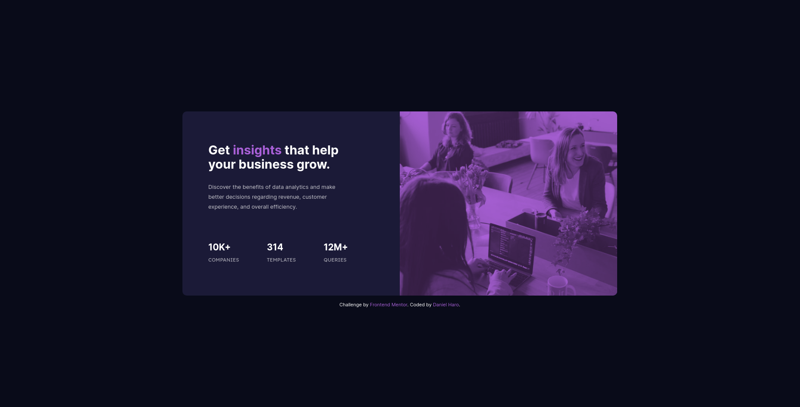

# Frontend Mentor - Stats preview card component solution

This is a solution to the [Stats preview card component challenge on Frontend Mentor](https://www.frontendmentor.io/challenges/stats-preview-card-component-8JqbgoU62). Frontend Mentor challenges help you improve your coding skills by building realistic projects. 

## Table of contents

- [Overview](#overview)
  - [The challenge](#the-challenge)
  - [Screenshot](#screenshot)
  - [Links](#links)
- [My process](#my-process)
  - [Built with](#built-with)
  - [What I learned](#what-i-learned)
  - [Continued development](#continued-development)
  - [Useful resources](#useful-resources)
- [Author](#author)

## Overview

### The challenge

Build out this card component and get it looking as close to the design as possible.

Users should be able to:

- View the optimal layout depending on their device's screen size


### Screenshot

Here's the finished project.



### Links

- Repository URL: [https://github.com/o0oDanielHaroo0o/stats-preview-card-component](https://github.com/o0oDanielHaroo0o/stats-preview-card-component)
- Live Site URL: [https://o0odanielharoo0o.github.io/stats-preview-card-component/](https://o0odanielharoo0o.github.io/stats-preview-card-component/)

## My process

- I started by analyzing the original design and planning my approach.
- I created the basic HTML structure and gave classes to the elements.
- I typed general styles shared by both mobile and desktop layouts.
- I styled the mobile layout first.
- I created two breakpoints for the layout to change to the desktop version.

### Built with

- Semantic HTML5 markup
- CSS custom properties
- Flexbox
- Mobile-first workflow

### What I learned

This was my first attempt to create a responsive page, I used the mobile-first workflow, relative units, flexbox and media queries to achive the result. I don't think it's perfect but it's a start. I had a lot of fun figuring out how to approach the desings.

I learned how basic media queries work.

I learned a nice trick to modify an image color, first I just though of using a div with a violet bgc and opacity on the image and it worked but I didn't get the exact color that I was looking for. After some research I found a property that I didn't know existed: mix-belnd mode. Combining this property with the image opacity I got much closer to the color of the original desing.

```css
.card__image-container {
    background-color: hsl(277, 64%, 61%);
}

.card__image {
    mix-blend-mode: multiply;
    opacity: 0.8;
}
```

### Continued development

- I will continue to improve my responsive designs.
- I started using BEM with this project but I want to continue improving my CSS organization and class naming.

### Useful resources

- [MDN mix-blend-in](https://developer.mozilla.org/es/docs/Web/CSS/mix-blend-mode) - This helped me achieve the color of the image.

## Author

- Frontend Mentor - [@o0oDanielHaroo0o](https://www.frontendmentor.io/profile/o0oDanielHaroo0o)
- GitHub - [o0oDanielHaroo0o](https://github.com/o0oDanielHaroo0o)